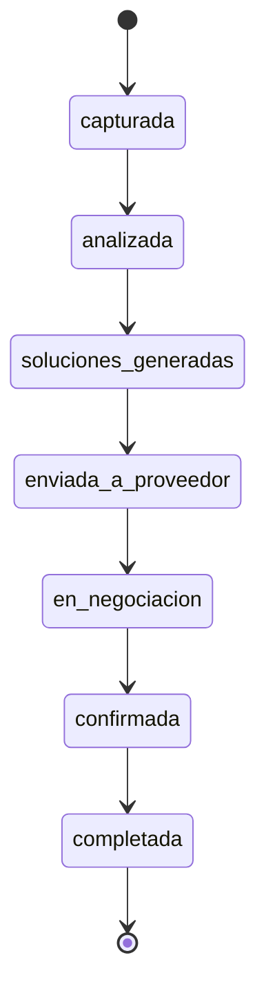

# System Overview

## Objetivo
Plataforma para conectar solicitudes técnicas de usuarios con proveedores locales de manufactura y servicios, usando IA para interpretar requerimientos y automatizar el flujo comercial.

## Bloques del sistema

### 1) frontend
- **Canal UI usuario**: formulario guiado para capturar necesidades, seguimiento de estado y confirmación de pedidos.
- **Panel proveedor**: recepción de oportunidades, gestión de propuestas, negociación y actualización de estado.
- **Stack inicial propuesto**: **Next.js + TypeScript**.

### 2) backend
- **API principal**: endpoints para intake, análisis, soluciones, órdenes y mensajería.
- **Lógica de negocio**: validación, reglas de matching, lifecycle de solicitudes, autorizaciones por rol.
- **Persistencia**:
  - **Base de datos**: **PostgreSQL**.
  - **Búsqueda (fase 1)**: PostgreSQL full-text.
  - **Búsqueda semántica (fase 2)**: **pgvector**.
- **Stack inicial propuesto**: **FastAPI o NestJS**.

### 3) ai-orchestrator
- **Descomposición de solicitudes**: extracción de intención, parámetros técnicos, constraints y prioridades.
- **Normalización**: transforma lenguaje natural en requerimientos estructurados para el motor de matching.
- **Orquestación de pasos IA**: pipeline de análisis, scoring de calidad y generación de soluciones candidatas.

### 4) marketplace-ops
- **Matching**: ranking de proveedores por capacidad, ubicación, SLA y historial.
- **Mensajería**: canal asíncrono para aclaraciones, cotizaciones y contraofertas.
- **Estado de pedidos**: seguimiento de cada transición y auditoría de eventos.
- **Cola asíncrona**: **Redis + workers** para tareas como contacto automático y seguimiento.

## Diagrama de estados de solicitud

